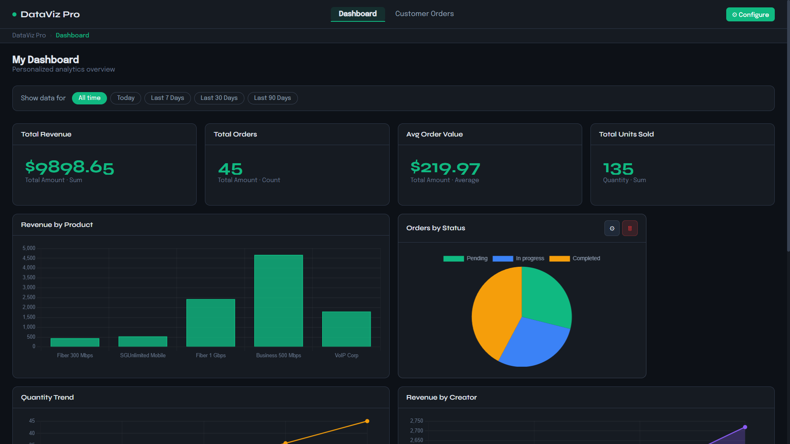
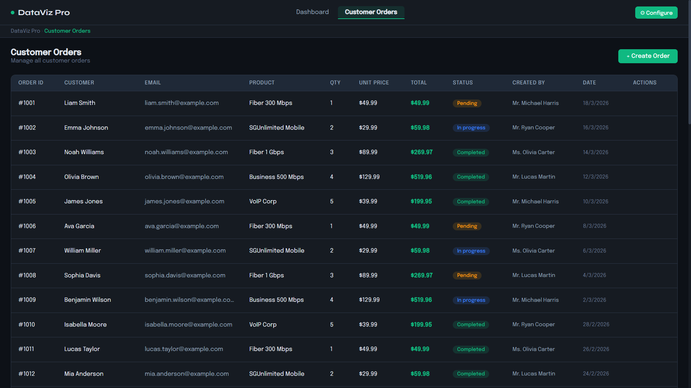
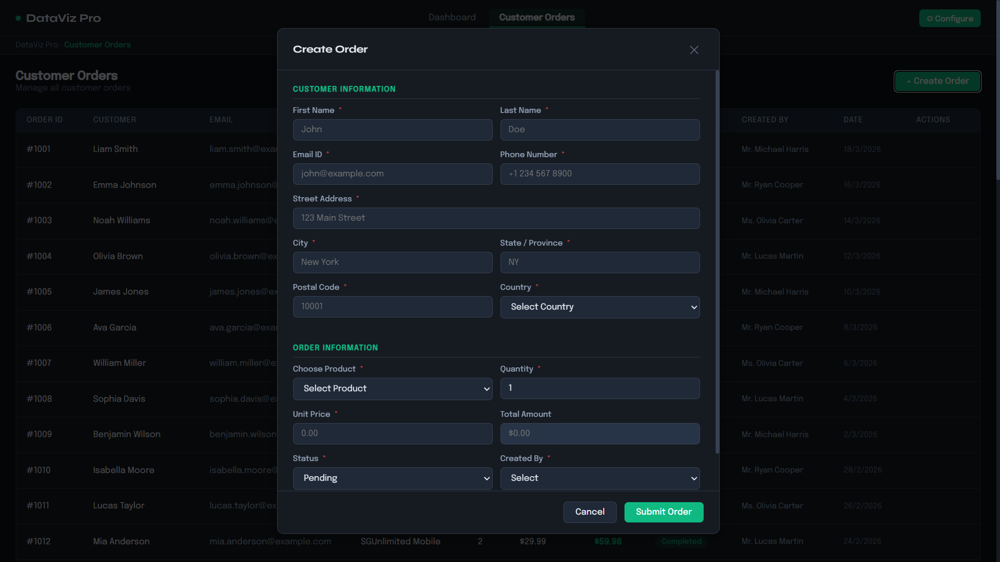
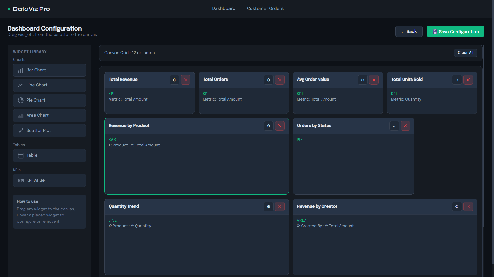
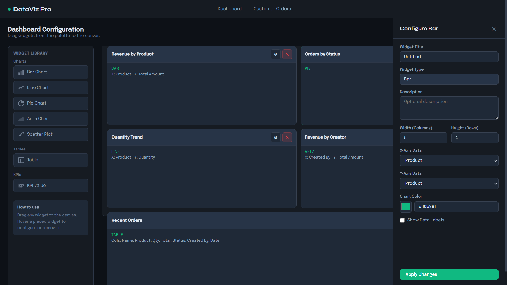

<div align="center">

# DataViz Pro
### Custom Dashboard Builder

A dark-themed business analytics dashboard with drag-and-drop widget builder,
real-time KPI cards, interactive charts, and full customer order management.


[▶ Watch Demo on YouTube](https://youtu.be/gN2dJB3nUnA)
</div>

---

## Screenshots

### Dashboard — KPI cards & live charts
> 4 KPI cards showing total revenue, orders, average order value and units sold. Bar chart, pie chart, line chart and area chart all populated from the 45 seed orders.



---

### Customer Orders — scrollable data table
> Full order table with all columns visible via horizontal scroll. Status badges (Pending / In Progress / Completed), edit and delete actions on hover.



---

### Create Order — form with two sections
> Two-section modal form covering Customer Information and Order Information. All fields are validated on submit. Total Amount auto-calculates from Qty × Unit Price.



---

### Configure Dashboard — drag-and-drop canvas
> Widget palette on the left (Charts, Tables, KPIs). Canvas on the right with a 12-column grid. Drag any widget in, hover to see settings or delete controls.



---

### Widget Settings — side panel
> Slide-in side panel for configuring each widget individually — title, dimensions, metric, aggregation, chart color, columns, pagination and more.



---

## Features

| Feature | Details |
|---|---|
| **KPI Cards** | Sum / Average / Count aggregation, Number or Currency format |
| **Charts** | Bar, Line, Area, Pie, Scatter — all driven by order data |
| **Data Table** | Configurable columns, pagination (5 / 10 / 15), custom header color |
| **Date Filter** | All time · Today · Last 7 / 30 / 90 days — updates all widgets live |
| **Drag & Drop** | 12-column canvas grid, widgets configurable after placement |
| **Order CRUD** | Create, edit, delete orders — all changes reflect in the dashboard |
| **Validation** | Mandatory field checks with inline error messages |
| **Seed Data** | 45 pre-loaded orders + 9 pre-built dashboard widgets on first load |
| **Responsive** | Table scrolls horizontally; grid collapses on smaller screens |
| **Favicon** | Custom SVG tab icon matching the app colour scheme |

---

## File Structure

```
dashboard/
├── index.html            ← HTML markup — links to styles.css and app.js
├── styles.css            ← All styles, CSS variables, responsive rules
├── app.js                ← All vanilla JS — state, CRUD, charts, drag-drop
├── App.jsx               ← Full React version using react-chartjs-2
├── README.md
└── screenshots/
    ├── 01_dashboard.png
    ├── 02_orders.png
    ├── 03_create_order_modal.png
    ├── 04_configure.png
    └── 05_widget_panel.png
```

---

## Running Locally in VS Code

### Vanilla (index.html + styles.css + app.js)

1. Open the `dashboard` folder in VS Code — `File → Open Folder`
2. Install the **Live Server** extension by Ritwick Dey
3. Right-click `index.html` in the file tree → **Open with Live Server**
4. Browser opens at `http://127.0.0.1:5500` — fully working, no build step

### React (App.jsx)

```bash
npm create vite@latest my-app -- --template react
cd my-app
npm install chart.js react-chartjs-2
# Copy App.jsx and styles.css into src/
npm run dev
```

In `src/main.jsx`:
```jsx
import './styles.css'
import App from './App'
```

---

## Pushing to GitHub

```bash
# First time
git init
git add .
git commit -m "first commit"
git branch -M main
git remote add origin https://github.com/YOUR-USERNAME/REPO-NAME.git
git push -u origin main

# Every update after that
git add .
git commit -m "describe your change"
git push
```

**Troubleshooting a push that shows no changes on GitHub:**

```bash
git remote -v          # check the remote URL is correct
git branch             # confirm you are on main, not master
git log --oneline -3   # confirm your commits exist locally
git push origin main --force   # force push if needed
```

---

## GitHub Pages (free hosting)

1. Repo → **Settings** → **Pages**
2. Source → **Deploy from branch** → branch: `main` → **Save**
3. Your site goes live at `https://YOUR-USERNAME.github.io/REPO-NAME/`

---

<div align="center">
Built with HTML · CSS · JavaScript · Chart.js
</div>
